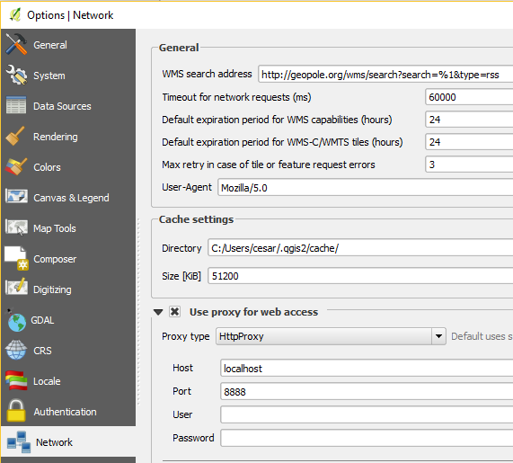

# Bitácora desarrollo de plugins con QGIS Plugin Builder
[QGIS Plugin Builder](http://g-sherman.github.io/Qgis-Plugin-Builder)

## Tareas
- Probar en una instalación normal a actualizar el pip como describo más abajo y ver si funciona. Nota: diferencia directorio con permisos.

## Instalación de QGIS
Versión: QGIS 2.18.1.
Instalador de QGIS.
Directorio de instalación: **C:\Dev\QGIS218**, es decir, **sin espacios ni puntos** en la ruta. Esto lo hago así para evitar errores de Path de las herramientas de Python (pip). Además, es una carpeta en la que mi usuario tiene permisos de escritura lo cual facilitará la instalación de extensiones en Python.

Resultado: **pip** sigue fallando. No lo consigo resolver tras investigar bastante.

### Alternativa pip
Prueba: *python -m pip list*

Me advierte que no tengo la última versión de pip y me sugiere que actualice, cosa que hago:
*python -m pip install --upgrade pip*

¡Y tras la instalación de la última versión funciona el pip!

## Entorno
Para la interfaz de comandos usar la Shell de OSGeo4W. Copio el acceso directo al escritorio dentro de la carpeta de QGIS para poder cambiar las preferencias de usuario.

## Creación del plugin
Sigo las instrucciones de la ayuda de la página de QGIS Plugin Builder. Repositorio en github incluido.

## Compilación y despliegue

### Manual
Siguiendo las instrucciones:  
*pyrcc4 -o resources.py resources.qrc*

Directorio destino: *%HOMEPATH%\.qgis2\python\plugins*

Hay que copiar el directorio completo.

### Si tenemos gmake (GNU make)
*make deploy*

### Método de variable de entorno
Using the QGIS_PLUGINPATH environment variable you can tell QGIS to look in an additional location for plugins. This can be handy for development, allowing you to test your plugin without copying it to .qgis2/python/plugins.

To use this method, set the QGIS_PLUGINPATH environment variable to point to your development directory before starting QGIS. When QGIS starts up, all the directories in QGIS_PLUGINPATH will be searched and those containing valid plugins will be added to the Plugin Manager.

Esta opción me parece buena por ser ágil. Modifico el BAT de inicio de QGIS (qgis.bat) añadiendo la siguiente línea:  
*set QGIS_PLUGINPATH=C:\SRC\RRTNUtils\rrtn-utils*

Aprendo a ver la configuración del entorno en QGIS: *Settings-> Options-> System*.

### pb_tool
*pip install pb_tool*  
Error: *Please install setuptools* -> Succesfull.  
Vuelvo a probar:  
*DEPRECATION: Uninstalling a distutils installed project*  
*WindowsError: [Error 2] El sistema no puede encontrar el archivo especificado...*  
Pruebo de nuevo y parece que funciona.

To upgrade to the latest version, use:  
*pip install –upgrade pb_tool*

Compilación y despliegue: pb_tool deploy

## Accediendo al plugin desde QGIS
Mismo error que con la aproximación de variable de entorno (QGIS_PLUGINPATH) :  
2016-12-06T20:51:27	1	Traceback (most recent call last):
			  File "C:/Dev/QGIS218/apps/qgis/./python\qgis\utils.py", line 333, in startPlugin
			    plugins[packageName] = package.classFactory(iface)
			AttributeError: 'module' object has no attribute 'classFactory'

El problema estaba en el nombre del Plugin, creo que porque he puesto paréntesis!

## Fiddler (escritorio)
En **Settinngs-> Options...-> Network**

Configurar para usar un proxy:
* HttpProxy
* Localhost
* 8888

## Reload plugin
Fundamental para el desarrollo.